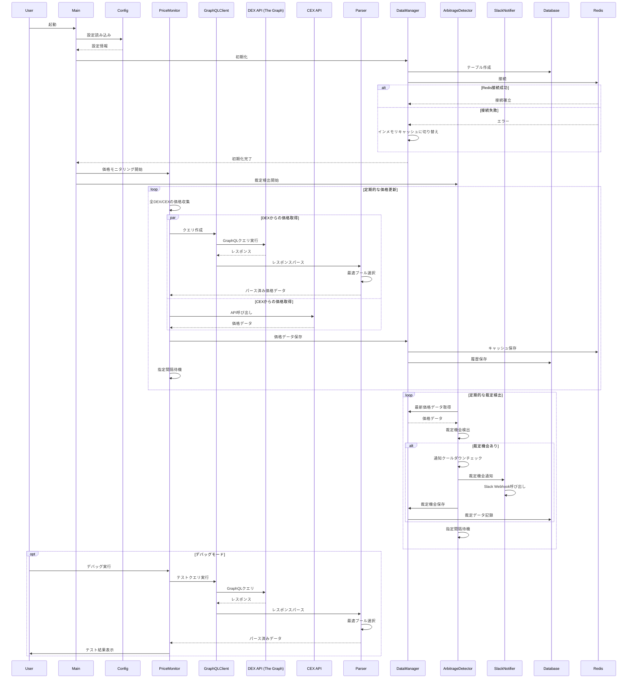

```mermaid
sequenceDiagram
    participant User
    participant Main
    participant Config
    participant PriceMonitor
    participant GraphQLClient
    participant DEX as DEX API (The Graph)
    participant CEX as CEX API
    participant Parser
    participant DataManager
    participant ArbitrageDetector
    participant SlackNotifier
    participant Database
    participant Redis

    User->>Main: 起動
    Main->>Config: 設定読み込み
    Config-->>Main: 設定情報

    Main->>DataManager: 初期化
    DataManager->>Database: テーブル作成
    DataManager->>Redis: 接続
    alt Redis接続成功
        Redis-->>DataManager: 接続確立
    else 接続失敗
        Redis-->>DataManager: エラー
        DataManager->>DataManager: インメモリキャッシュに切り替え
    end
    DataManager-->>Main: 初期化完了

    Main->>PriceMonitor: 価格モニタリング開始
    Main->>ArbitrageDetector: 裁定検出開始

    loop 定期的な価格更新
        PriceMonitor->>PriceMonitor: 全DEX/CEXの価格収集

        par DEXからの価格取得
            PriceMonitor->>GraphQLClient: クエリ作成
            GraphQLClient->>DEX: GraphQLクエリ実行
            DEX-->>GraphQLClient: レスポンス
            GraphQLClient->>Parser: レスポンスパース
            Parser->>Parser: 最適プール選択
            Parser-->>PriceMonitor: パース済み価格データ
        and CEXからの価格取得
            PriceMonitor->>CEX: API呼び出し
            CEX-->>PriceMonitor: 価格データ
        end

        PriceMonitor->>DataManager: 価格データ保存
        DataManager->>Redis: キャッシュ保存
        DataManager->>Database: 履歴保存

        PriceMonitor->>PriceMonitor: 指定間隔待機
    end

    loop 定期的な裁定検出
        ArbitrageDetector->>DataManager: 最新価格データ取得
        DataManager-->>ArbitrageDetector: 価格データ

        ArbitrageDetector->>ArbitrageDetector: 裁定機会検出

        alt 裁定機会あり
            ArbitrageDetector->>ArbitrageDetector: 通知クールダウンチェック
            ArbitrageDetector->>SlackNotifier: 裁定機会通知
            SlackNotifier->>SlackNotifier: Slack Webhook呼び出し
            ArbitrageDetector->>DataManager: 裁定機会保存
            DataManager->>Database: 裁定データ記録
        end

        ArbitrageDetector->>ArbitrageDetector: 指定間隔待機
    end

    opt デバッグモード
        User->>PriceMonitor: デバッグ実行
        PriceMonitor->>GraphQLClient: テストクエリ実行
        GraphQLClient->>DEX: GraphQLクエリ
        DEX-->>GraphQLClient: レスポンス
        GraphQLClient->>Parser: レスポンスパース
        Parser->>Parser: 最適プール選択
        Parser-->>PriceMonitor: パース済みデータ
        PriceMonitor->>User: テスト結果表示
    end
```
